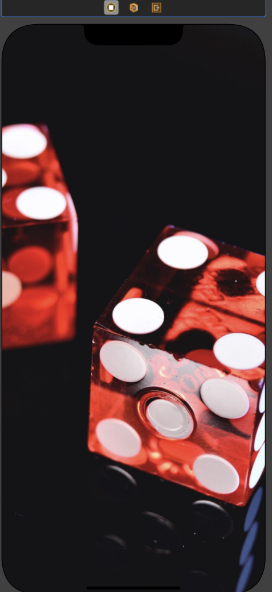
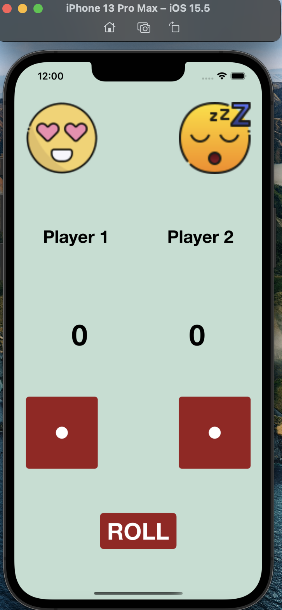
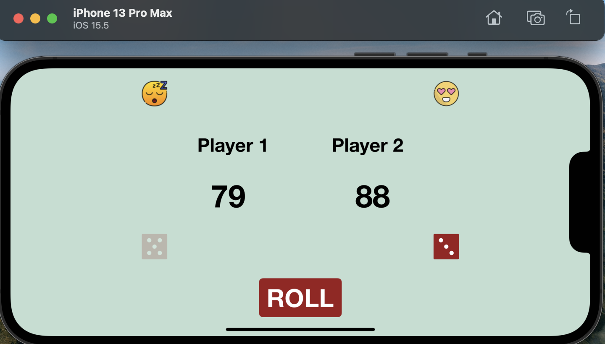
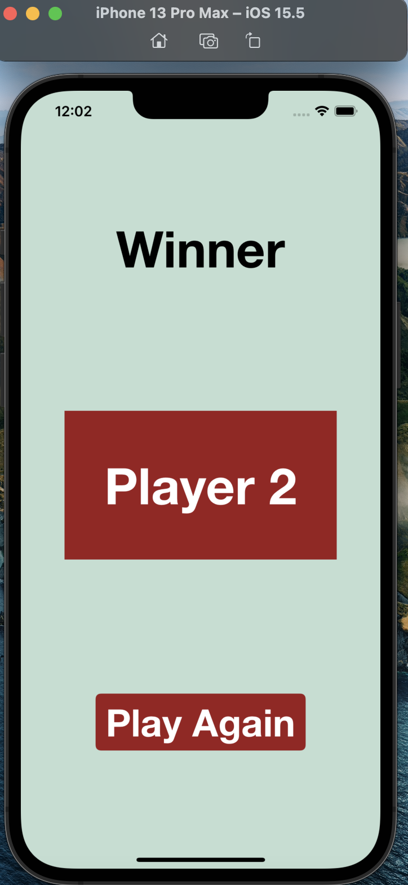
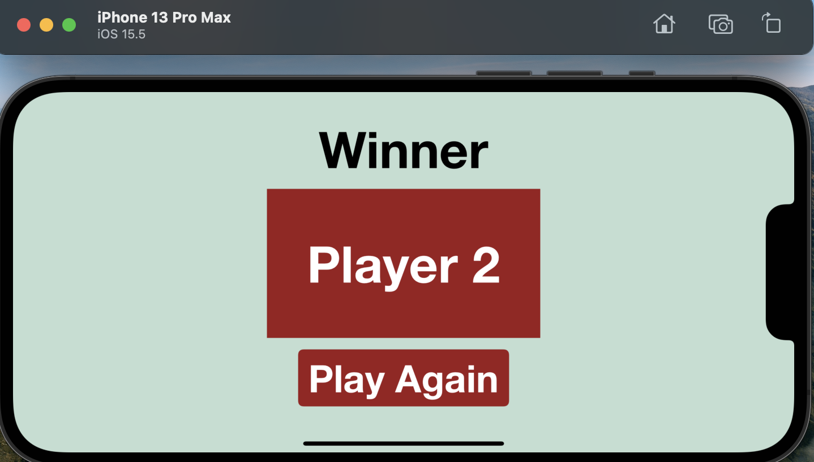

# Dice100
2-player dice game where the player who scores 100 first wins

# Responsive UI Snapshots

 &nbsp; 
 &nbsp; 

# Techstack
  

# Resources

<a href="https://www.canva.com" target="_blank">Canva</a> <a href="https://colorhunt.co" target="_blank">Colorhunt</a>
